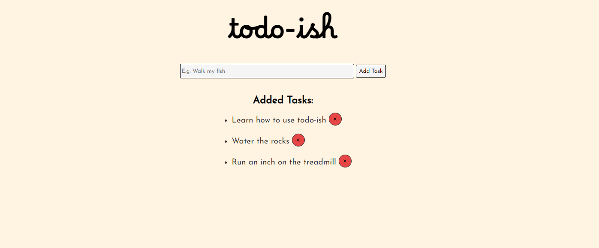

<h1> Welcome to ToDo-ish! </h1>

<h3>What is this?</h3>

ToDo-ish is an app dedicated to serving your busy day. As hard-working people we have tons of duties, and it may not be a good idea trying to store all of it in your head.

Thus, use ToDo-ish to your advantage! A simple yet effective to-do app.

<h3>What's up with the name?</h3>

Well, there are 2 reasons.

<ol>
    <li>
        Whenever you randomly remember that you need to email Jeff in the middle of a workout, you are most likely NOT going to write it down on a sticky note. 
        
It's a task, but you did NOT write it down! As a result, it becomes a "~todo-ish~" task; an item that ~mayyy~ or may not be completed on time.

    </li>
    <li>
        In a language that I speak, Uzbek, the word "ish" defines "a task/job".
        

        Since this is a to-do app where all of your tasks get written, I thought "why not translate the word to another language?"

    </li>
</ol>

<h3>Cool, how do I use it?</h3>
<ol>
    <li>Run "npm i" to install all required dependencies.</li>
    <li>Start the server using "node index.js".</li>
    <li>Navigate on your browser "http://localhost:3000/" to view the app.</li>
</ol>

<h3>What tools did you use?</h3>
<h3>What problems did you come across?</h3>
<h3>What's next for this project?</h3>

